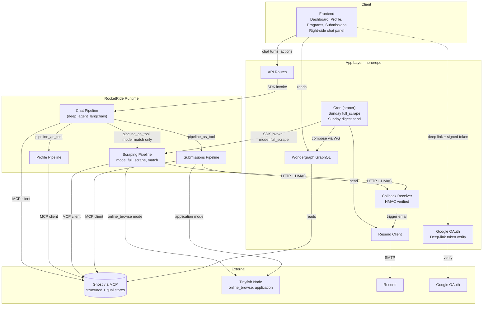

# Fundip Architecture

Fundip is an agent-driven funding program discovery and submission tool for startups. It builds startup profiles conversationally, scrapes the web for matching programs on a weekly cadence, and submits applications on behalf of the user with a human in the loop for missing data.

## Layers

1. **Client**: React UI (existing scaffold). Four pages in order: Dashboard, Profile, Programs, Submissions. Persistent chat panel on the right side of every page.
2. **App layer** (Node, monorepo): API routes, Wondergraph GraphQL server, croner-based scheduler, HMAC-verified callback receiver, Resend integration, Google OAuth, deep-link token verifier.
3. **RocketRide runtime**: Four pipelines (chat, profile, scraping, submissions). All pipeline invocations originate from the app layer.
4. **External services**: Ghost (accessed via MCP), Tinyfish (new RocketRide node, two modes), Resend, Google OAuth.

## Data flow

## Key rules encoded in the diagram

- Pipelines never send email directly. They emit HMAC-signed HTTP callbacks to the app layer, which composes and sends via Resend.
- Pipelines never schedule themselves. Cron lives in the app layer.
- Wondergraph is frontend-only. Pipelines talk to Ghost through MCP, not through Wondergraph.
- Chat is the only user-facing runtime surface. No other pipeline calls chat. No circular pipeline invocations.
- The scraping pipeline is the only pipeline with two modes. Chat can invoke it in `match` mode only. `full_scrape` is cron-triggered.
- Direct profile form edits write to Ghost via Wondergraph mutations and bypass the profile pipeline. The profile pipeline runs only for conversational edits.

## Weekly cycle (Sundays)

1. Cron fires `scraping` pipeline with `mode=full_scrape`. Pipeline calls Tinyfish `online_browse` against known sources, writes new and updated programs to Ghost.
2. Cron iterates active profiles, fires `scraping` pipeline with `mode=match` for each. Each run writes `program_matches` to Ghost and emits a `matches_ready` callback to the app.
3. Cron composes one digest email per profile (10 to 30 matches surfaced per week), sends via Resend. Email contains per-program sections with name, requirements, positioning summary, numeric 0 to 100 score (rendered as a visual meter), 3 to 5 sentence prefill summary, and a deep-link button to the confirmation page.

## Submission cycle (user-initiated)

1. User clicks deep-link button in match email, or clicks Apply on the Programs/Submissions page.
2. App verifies signed token (email path) or authenticated session (in-app path).
3. App invokes `submissions` pipeline with `action=prefill_only`.
4. Pipeline generates full form payload from profile, writes `submissions` row with status `prefilled` or `needs_input`.
5. If `needs_input`, pipeline emits a `submission_needs_input` callback. App sends the missing-info email (program info, gaps, redirect button to Profile page).
6. User fills gaps on the Profile page (direct Wondergraph write) or in chat (conversational, goes through profile pipeline).
7. App re-invokes `submissions` pipeline with `action=submit`. Pipeline calls Tinyfish in `application` mode, submits, writes final state.
